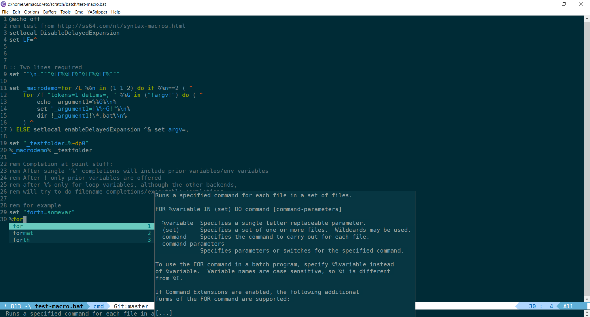

# cmd-mode - Major mode for editing DOS/Windows scripts

*Version:* 1<br>
*URL:* [http://github.com/nverno/cmd-mode](http://github.com/nverno/cmd-mode)<br>

Extension of `bat-mode`, a major mode for editing DOS/Windows scripts
(batch files).  This verison is extended to provide indentation,
completion at point functions, extra syntax, user functions,
basic interactive shell.

See [company-cmd](http://github.com/nverno/company-cmd)
for company autocompletion/quickhelp support.

## Features include

* Syntax highlighting
* Indentation: using smie
* Completion: completion-at-point for local/environment variables
* Access DOS help pages
* imenu/outline navigation
* Compilation support / running scripts
* Interactive shell modeled after sh-script.el, but needs work to be useful
  at this point: newlines need to be stripped and %% converted to %.

## The syntax groups for highlighting are

    ;; Face					Example
    ;;
    ;;  cmd-label-face				:LABEL
    ;;  cmd-escaped-newline-face	    ^
    ;;  font-lock-comment-face		rem
    ;;  font-lock-builtin-face		copy
    ;;  font-lock-keyword-face		goto
    ;;  font-lock-warning-face		cp
    ;;  font-lock-constant-face		[call] prog
    ;;  font-lock-variable-name-face	%var%
    ;;  font-lock-type-face			-option

### Usage

Just needs to be on the `load-path` and either explicitly required, or
`cmd-mode` needs to be autoloaded.  In the init file, to use this mode
instead of builtin `bat-mode`:

```lisp
(defalias 'bat-mode 'cmd-mode)
```

See documentation of function `cmd-mode`.

### Acknowledgements

Extension of base bat-mode.el to include indentation, completion,
modified syntax and font-locking, some extra user functions and basic
interface for interactive shell.  Mostly modeled after sh-script.el

Example using `company-cmd` with `company-capf` (completion-at-point),
ie:

```lisp
'(company-capf :with company-cmd)
```
as company-backend and `company-quickhelp` for dropdown help.




---
Converted from `cmd-mode.el` by [*el2markdown*](https://github.com/Lindydancer/el2markdown).
